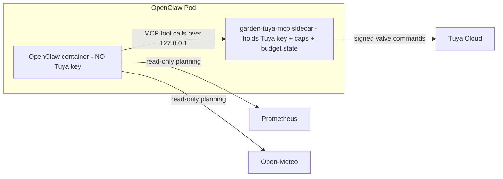

# Tuya MCP Policy Gateway — Design

**Date:** 2026-06-04
**Status:** Approved (brainstorming) — pending implementation plan
**Related:** [[2026-06-02-openclaw-irrigation-design]] (the irrigation CLI this hardens)

## Problem

Today OpenClaw holds `TUYA_CLIENT_SECRET` in its own pod container env and runs
`garden.py water` as a subprocess. All the safety logic (`clamp_minutes`, daily
budget in `State`, the pending-plan gate, `Tuya`, `do_water`) lives in that same
process the agent fully controls. A prompt-injected or compromised agent can
therefore bypass every guard: call Tuya directly with the key it can read, or run
`garden water --force` to skip the approval gate. The caps are advisory, not
enforced — they live inside the blast radius.

## Goal

Establish a **trust boundary**. Move the Tuya credential and the non-bypassable
enforcement (per-zone per-run cap, per-zone daily budget, approved-zone/param
allowlist, hardware auto-off verification) into a separate process — a **Tuya MCP
server** — that the agent can only reach through a narrow tool API. The agent
becomes an untrusted client. The MCP is the only thing that holds the key and the
only thing that can talk to Tuya.

Non-goals (explicitly out of scope, YAGNI):
- Moving the planning formula or sensor/weather reads into the MCP (stays in the
  read-only CLI; the MCP is a thin valve gateway).
- Moving the Discord human-approval step into the boundary (stays agent-side; the
  daily budget is the enforced blast-radius limit).
- Prometheus metrics from the MCP (audit-to-stdout now; counters are a later
  optional add).

## Architecture & Trust Boundary

`garden-tuya-mcp` runs as a **sidecar container** in the OpenClaw pod.

- The Tuya `client_secret` (Azure Key Vault CSI) and the authoritative caps config
  are mounted **only into the sidecar container** — removed from OpenClaw's
  container entirely.
- OpenClaw reaches the MCP over **localhost streamable-HTTP**
  (`http://127.0.0.1:8765/mcp`), bound to `127.0.0.1`. Containers in a pod share a
  network namespace, so only same-pod containers can reach it; nothing is exposed
  on the cluster network. No additional network auth is needed — the security
  boundary is the container + secret-mount, not the network.



## Tool Surface

The complete set of actions available to the agent. No `force`, no runtime
`--dry-run` bypass, no tool that sets the budget counter.

| Tool | Args | Returns | Notes |
|---|---|---|---|
| `list_zones` | — | `[{zone, max_per_run, max_per_day, watered_today, remaining_today, min_run}]` | No secrets. Lets the agent plan within limits. |
| `get_zone_status` | `zone` | `{switch, countdown_remaining_s, ...}` | Live Tuya device status (needs the key → via MCP). |
| `water_zone` | `zone`, `minutes` | `{zone, requested, granted, ok, reason, switch_confirmed}` | The enforced action. Clamps + records + verifies auto-off. |
| `stop_zone` | `zone` | `{zone, ok}` | Immediate valve close. Safety tool — always allowed. |

`water_zone` semantics:
1. Reject if `zone` is not in the approved allowlist (returns `ok: false`,
   `reason: "unknown zone"`).
2. `granted = clamp_minutes(requested, zone_caps, watered_today)` — clamps through
   `max_per_run` then the remaining daily budget; below `min_run` → 0.
3. If `granted == 0`: return `ok: true, granted: 0` with a reason (nothing sent).
4. Otherwise send `switch=on` + `countdown=granted*60`, **verify the countdown DP
   was accepted** (the hardware auto-off), failsafe-OFF if not (reuse `do_water`).
5. On confirmed success, record `granted` minutes to the budget state.
6. Always emit a structured audit line (see below). Always report `requested` vs
   `granted` so a clamp is visible to the agent and the human.

## Enforcement & State

**Authoritative config** (mounted to the sidecar only; agent cannot edit):

```json
{
  "region": "us",
  "timezone": "America/Chicago",
  "zones": [
    {"name": "zone1", "tuya_device_id": "...", "switch_dp": "switch",
     "countdown_dp": "countdown_1", "max_per_run": 15, "max_per_day": 30, "min_run": 1},
    {"name": "zone2", "tuya_device_id": "...", "switch_dp": "switch",
     "countdown_dp": "countdown_1", "max_per_run": 15, "max_per_day": 30, "min_run": 1}
  ]
}
```

`TUYA_CLIENT_ID` / `TUYA_CLIENT_SECRET` arrive via env from the Key Vault CSI mount
(sidecar only), not in the config file.

**Budget state** lives on a small **PVC mounted only to the sidecar** (survives pod
restarts; the agent can neither read nor reset it). `emptyDir` is rejected because a
pod restart would zero the daily counter and reopen the blast radius.

- Per-zone minutes watered today, keyed by the **local day** in the configured
  `timezone` (e.g. `America/Chicago`), reset at local midnight.
- Reuses the existing `State` JSON-on-disk pattern (atomic tmp-write + `os.replace`),
  generalized so `_day()` uses `zoneinfo.ZoneInfo(timezone)` instead of `gmtime`.

**Auto-off verification** is preserved exactly from `do_water`: after sending the
countdown DP, poll device status up to N times; if the countdown is never confirmed,
send a failsafe OFF and return `ok: false`.

**Audit:** every tool call writes one structured JSON line to stdout —
`{ts, tool, zone, requested, granted, decision, ok, reason}` — captured by cluster
logging. (Prometheus counters via the existing Pushgateway are a deferred optional.)

## Code Layout / Refactor

```
irrigation/
  garden_core.py    # NEW shared module (no secret at rest):
                    #   clamp_minutes, plan_zone (pure)
                    #   Tuya, do_water           (constructed only where the key is)
                    #   BudgetState              (tz-aware daily budget; MCP-owned)
  garden.py         # CLI — keeps sensors / weather / plan (read-only, key-free).
                    #   DROPS: cmd_water, cmd_status, _tuya_from_env, --force, --dry-run.
                    #   Imports plan_zone from garden_core.
  mcp/
    server.py       # FastMCP server: the 4 tools; the ONLY place that constructs
                    #   Tuya with the secret; owns BudgetState + the allowlist.
    config.example.json
    requirements.txt # mcp (official SDK); rest stdlib
    tests/
```

**Critical invariant:** after the refactor, `garden.py` contains **no Tuya code path
and needs no Tuya credential**. The agent's container can run only `sensors`,
`weather`, `plan` — all read-only against Prometheus/Open-Meteo. Every valve action
flows through the sidecar.

The pending-plan/approval gate (`set_pending`/`get_pending`/`--force`) is **removed**
from the runtime path: the agent orchestrates Discord approval as before, but the
hard limit is now the MCP's daily budget, which the agent cannot exceed regardless of
approval. (This is the explicitly chosen "thin gateway" scope.)

## Deployment (bigboy Flux repo)

- **New GHCR image** `garden-tuya-mcp`, built in CI the same way as the ingest image
  (multi-arch amd64/arm64).
- **OpenClaw Deployment** changes:
  - Add the `garden-tuya-mcp` sidecar container (the new image), command runs the
    streamable-HTTP MCP server bound to `127.0.0.1:8765`.
  - Move the Tuya `SecretProviderClass` / Key Vault CSI mount + env to the **sidecar
    container only**; **remove** the Tuya env from the OpenClaw container.
  - Add a small **PVC** for budget state, mounted only to the sidecar.
  - Register the MCP endpoint (`http://127.0.0.1:8765/mcp`) in OpenClaw's MCP client
    config.
- The OpenClaw irrigation SKILL.md is updated: `garden water`/`garden status` →
  `water_zone`/`get_zone_status` MCP tools; remove `--force`; the daily cap is the
  enforced limit.

## Error Handling

- Unknown zone → `ok: false, reason: "unknown zone"`, nothing sent, audited.
- Over-cap request → clamped (not rejected): `granted < requested`, `ok: true`,
  reason states the clamp; daily-budget-exhausted clamps to 0.
- Tuya API error / token failure → `ok: false, reason: "<TuyaError msg>"`, audited;
  the agent reports and moves on (no retry storms).
- Auto-off not confirmed → failsafe OFF sent, `ok: false`, audited.
- MCP unreachable from agent → MCP tool call fails; agent reports inability to water
  (fails safe — no valve opens).
- Budget state file corrupt/missing → treated as zero-watered for the day (fail
  toward *not* watering is impossible here; instead this fails toward *allowing* up
  to the cap — acceptable because the per-run and per-day caps still bound it, and a
  corrupt-state alert can be added later).

## Testing

Reuse the existing fake-`http=` injection on `Tuya` (no network in tests).

- Move existing Tuya/caps/`do_water` tests onto `garden_core`.
- New MCP enforcement tests:
  - cross-call daily budget: two `water_zone` calls sum toward `max_per_day`; the
    second is clamped to the remainder.
  - local-midnight reset: budget resets when the configured-TZ day rolls over
    (inject a fake clock).
  - zone allowlist: `water_zone("zoneX")` for an unknown zone is rejected, nothing
    sent.
  - auto-off failsafe: countdown never confirmed → failsafe OFF + `ok: false`.
  - requested-vs-granted reporting: an over-cap request returns `granted < requested`
    with a reason.
  - `garden.py` no longer imports/needs Tuya creds (a test asserting `plan`/`sensors`
    run with no Tuya env set).

Built TDD-style via subagent-driven-development.

## Success Criteria

1. OpenClaw's container has **no** Tuya credential in env or filesystem; `garden.py`
   runs `sensors`/`weather`/`plan` with no Tuya env present.
2. The agent can open a valve **only** via `water_zone`, and **cannot** exceed
   `max_per_run` or the per-zone local-day budget by any sequence of calls.
3. The daily budget persists across a sidecar/pod restart.
4. Every valve decision is auditable from stdout logs.
5. Hardware auto-off verification (failsafe OFF) is preserved.
